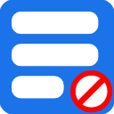

,
# Feedider
Feedider helps to hide distracting feeds or other similar sections from youtube, facebook, instagram, linkedin, twitter and reddit.

## Features

### Youtube
    ✔ Thumbnails
    ✔ Home Feed
    ✔ Comments
    ✔ Video End Feed and Cards
    ✔ Subscriptions and Explore Buttons
    ✔ Left Sidebar
    ✔ Search Suggestions
    ✔ Video Description
    ✔ People also Watched Videos
    ✔ Trending
    ✔ Playlists
    ✔ Mixes
    ✔ Disable Autoplay

### Facebook
    ✔ Home Page Feed
    ✔ Stories
    ✔ Likes and Comments
    ✔ People You May Know
    ✔ Right Rail
    ✔ Left Rail

### Instagram
    ✔ Posts
    ✔ Stories
    ✔ Suggestions
    ✔ Likes, Comments and Description

### LinkedIn
    ✔ Home Feed
    ✔ News
    ✔ Comments

### Twitter
    ✔ Timeline
    ✔ Trending
    ✔ Likes
    ✔ Retweets

### Reddit
    ✔ Home Feed
    ✔ Recommended Communities
    ✔ Comments

## Install
Available in <a href="https://chrome.google.com/webstore/detail/feedider/ljfikgipfnfppelplmgdpmooaoehaljb/">Chrome Web Store</a>
